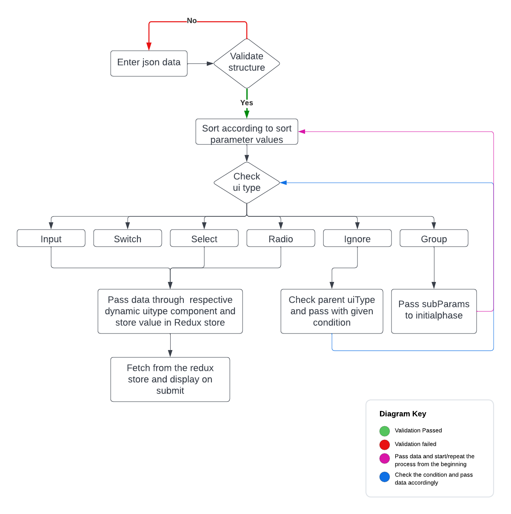

**<p align="center"> Frontend Task</p>**
# Table of Contents
- [Work flow](#struc)
- [Technologies used](#Tech)
- [Deploy Link: https://63add73153ceb40f09a39eee--tubular-sunburst-6536d7.netlify.app/](#ER)
- [Demo Video](#run)

<a name="struc"></a>
# Work flow


<a name="Tech"></a>
# Technologies Used
- Reactjs
- React-bootstrap
- Redux
- react-json-editor-ajrm


<a name="Er"></a>
# Demom Link

<a name="run"></a>
# How to run the code

```
Open the Source code folder and open root code in your editor and 
$ npm i (install backend dependencies)
$ npm start
Open localhost:3000 and to find the magic

```

